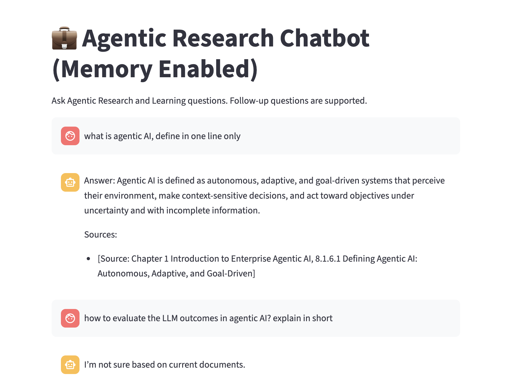
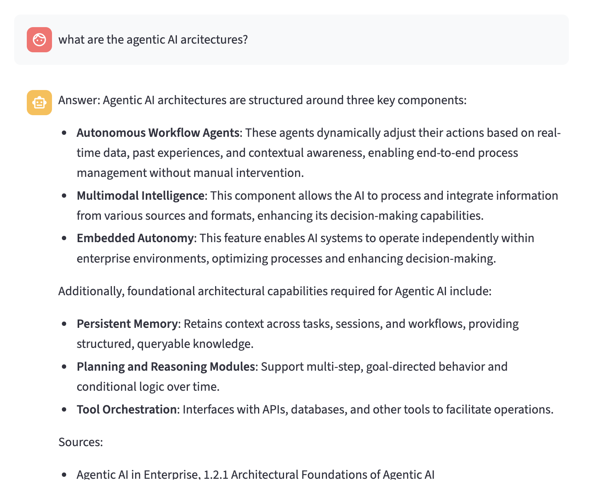
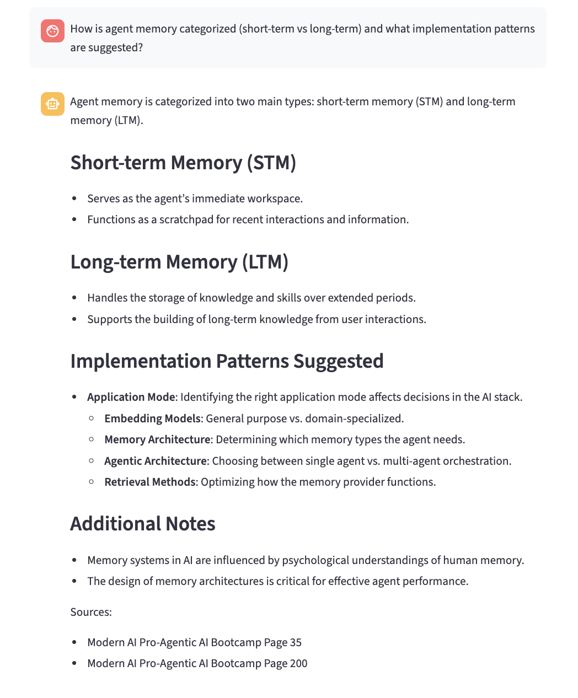

# Agentic Research Chatbot (RAG + Memory)

A Retrieval-Augmented Generation (RAG) research assistant built with Streamlit, LangChain, OpenAI embeddings, and FAISS that answers questions grounded in enterprise AI documents.

The system retrieves relevant passages from a document knowledge base and generates responses strictly based on the retrieved context, enabling accurate, citation-based research assistance with conversational memory for follow-up questions.

A RAG-based Agentic Research Chatbot with persistent memory designed to answer research and learning questions while supporting follow-up queries.

## Introduction
Agentic AI refers to goal-driven AI systems that can perceive context, reason about information, and take actions autonomously to achieve objectives.

In this project, the system combines Retrieval-Augmented Generation (RAG) with memory-enabled interactions, allowing the model to retrieve relevant documents while maintaining conversational context across multiple queries. This helps the assistant produce grounded responses rather than relying purely on the LLM’s internal knowledge.

Key capabilities of the solution include:
 - Context-aware responses through document retrieval
 - Persistent conversational memory for follow-up questions
 - Structured knowledge grounding using curated research sources
 - Agentic reasoning flow that combines retrieval, reasoning, and response generation

## Overview

This project implements a memory-enabled research chatbot designed to support applied AI engineering teams.

Instead of relying on an LLM’s internal knowledge, the assistant retrieves information from indexed research documents and generates responses grounded strictly in the retrieved context.

The architecture combines:

- Document ingestion pipeline

- Vector search retrieval

- LLM reasoning

- Conversation memory

- Streamlit interface

This approach improves reliability and reduces hallucinations compared to standard LLM chatbots.

## Key Features

#### Retrieval-Augmented Generation (RAG)
Answers are generated using document retrieval from a FAISS vector database.

#### Grounded Responses
The system enforces strict prompting rules so responses rely only on retrieved context.

#### Citation-Based Output
Every answer includes document source references.

#### Follow-Up Questions (Memory)
Chat history is maintained, allowing multi-turn research conversations.

#### Fast Vector Search
FAISS enables efficient similarity search over embedded document chunks.

#### Interactive UI
Streamlit provides a simple research assistant interface.

## Architecture

```aiignore

PDF Documents
      │
      ▼
Document Loader (PyPDFLoader)
      │
      ▼
Text Chunking (RecursiveCharacterTextSplitter)
      │
      ▼
Embedding Generation (OpenAI text-embedding-3-small)
      │
      ▼
Vector Database (FAISS)
      │
      ▼
Retriever (Top-k similarity search)
      │
      ▼
LLM (GPT-4o-mini)
      │
      ▼
Streamlit Chat Interface


```

## Document Ingestion Pipeline

The ingestion script:

- Loads PDF documents

- Splits them into semantic chunks

- Generates embeddings

- Stores them in FAISS

#### Core Components

- PyPDFLoader – loads research PDFs

- RecursiveCharacterTextSplitter – splits long text into chunks

- OpenAIEmbeddings – converts text to vectors

- FAISS – stores vectors for similarity search

The resulting vector database is saved locally for fast retrieval.

## Chatbot Application

The Streamlit application performs the following steps:

- Accept user research questions

- Retrieve relevant document chunks

- Build a grounded prompt with context

- Generate answers using GPT-4o-mini

- Maintain chat history for follow-up questions

- Display sources for traceability

Caching is used to prevent reloading embeddings or models unnecessarily.


# Sample questions

“How is agent memory categorized (short-term vs long-term) and what implementation patterns are suggested?”

“What architectural components are required to move from a prompt-driven workflow to an autonomous agent system?”

“What are the differences between tool-using agents and workflow automation systems?”

“What constraints are recommended to prevent uncontrolled reasoning loops?”

## Output





